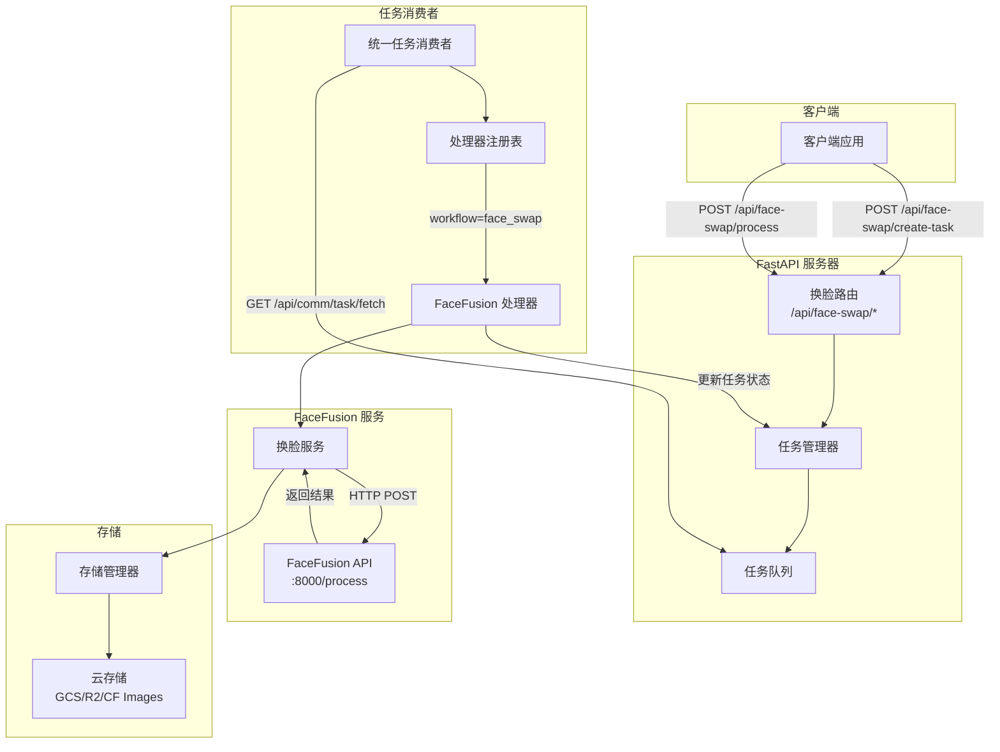
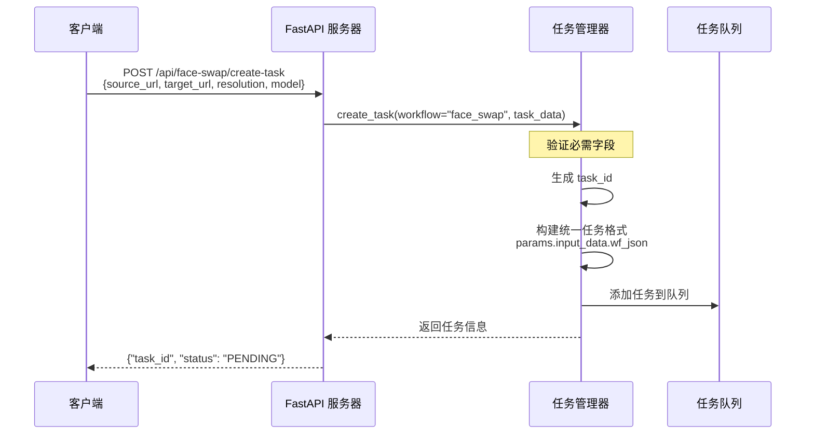
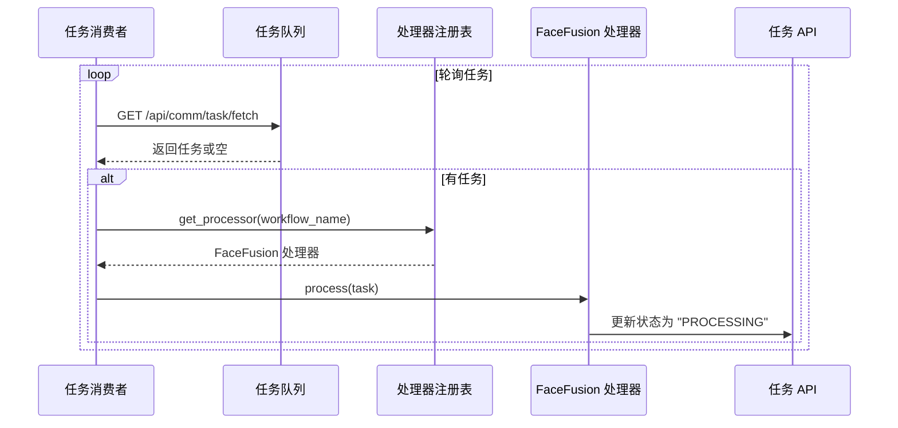
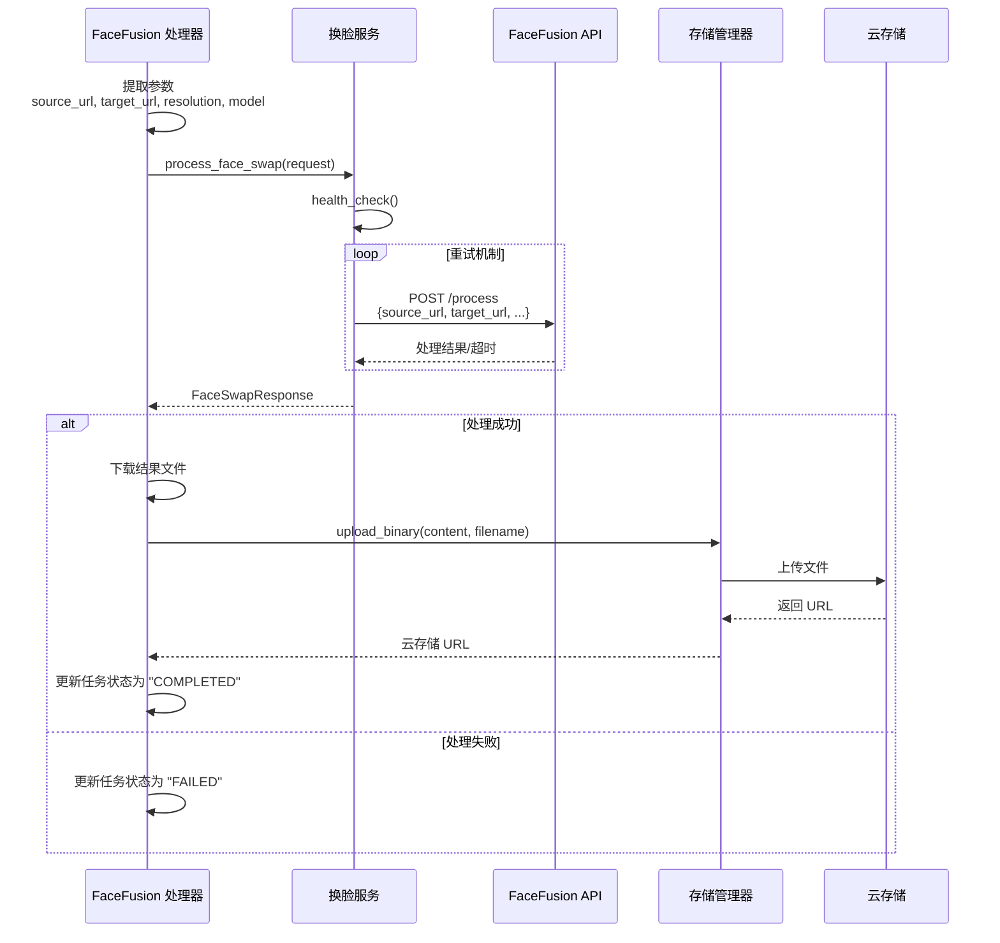
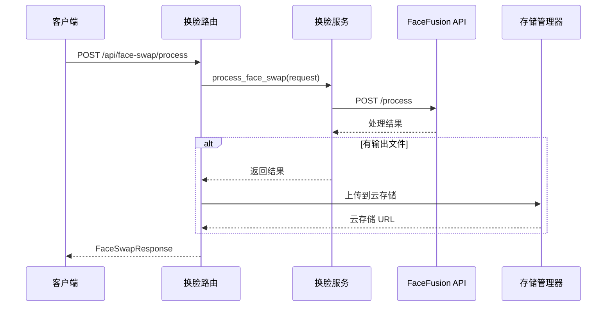
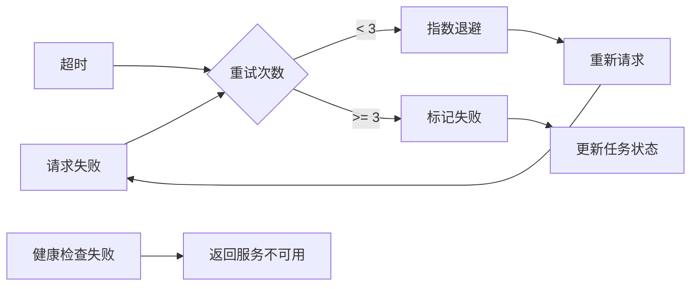
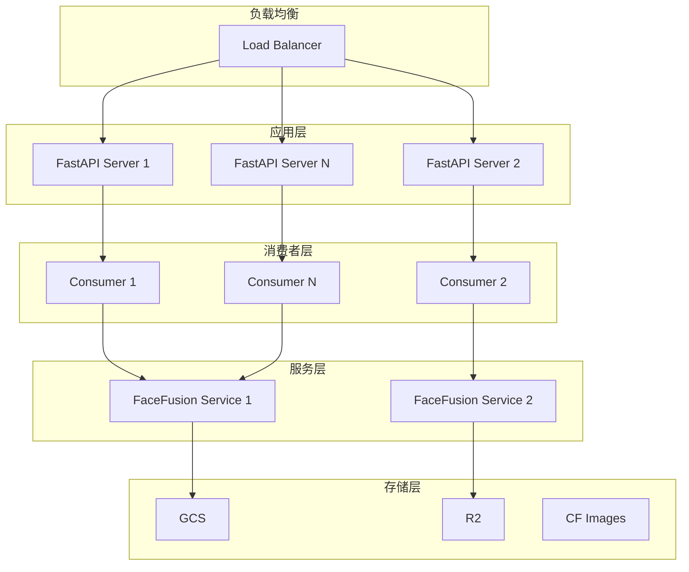

# FaceFusion 调用流程图

## 系统架构概览



## 详细调用流程

### 1. 任务创建流程



### 2. 任务消费流程



### 3. FaceFusion 处理流程



### 4. 直接处理流程（同步）



## 关键数据结构

### 统一任务格式
```json
{
    "taskId": "task_12345",
    "workflow": "face_swap",
    "environment": "face_swap",
    "target_port": 8000,
    "params": {
        "input_data": {
            "wf_json": {
                "source_url": "https://...",
                "target_url": "https://...",
                "resolution": "1024x1024",
                "model": "inswapper_128_fp16"
            }
        }
    },
    "status": "PENDING",
    "source_channel": "http://localhost:8000",
    "created_at": "2025-01-30T12:00:00",
    "updated_at": "2025-01-30T12:00:00"
}
```

### FaceSwapResponse
```json
{
    "status": "success",
    "output_path": "http://localhost:8000/outputs/result.jpg",
    "processing_time": 12.5,
    "job_id": "job_12345",
    "metadata": {
        "gif_url": "http://localhost:8000/outputs/result.gif",
        "webp_url": "http://localhost:8000/outputs/result.webp",
        "storage_url": "https://storage.googleapis.com/...",
        "storage_provider": "gcs"
    }
}
```

## 错误处理和重试机制



## 性能优化策略

1. **并发处理**: Task Consumer 支持多实例并发运行
2. **批量上传**: 支持多种输出格式（jpg, gif, webp）批量上传
3. **本地文件优化**: 当 FaceFusion 和 FastAPI 在同一机器时，直接读取本地文件
4. **重试机制**: HTTP 请求使用 httpx-retries 自动重试
5. **异步处理**: 使用 asyncio 实现高效的异步 I/O

## 部署架构



## 监控和日志

- **任务状态跟踪**: 通过 task_id 跟踪整个生命周期
- **性能指标**: processing_time 记录处理耗时
- **错误日志**: 详细记录每个阶段的错误信息
- **健康检查**: 定期检查 FaceFusion 服务可用性

## 安全考虑

1. **URL 验证**: 验证输入 URL 的合法性，防止 SSRF 攻击
2. **超时控制**: 设置合理的超时时间（默认 120 秒）
3. **文件大小限制**: 通过存储服务限制上传文件大小
4. **访问控制**: 使用环境变量控制服务访问权限